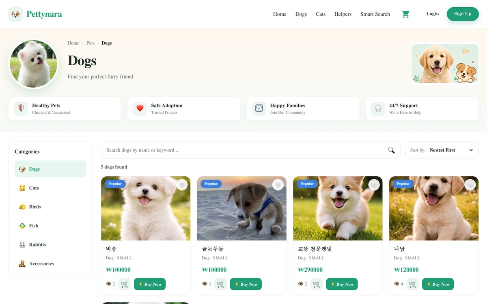
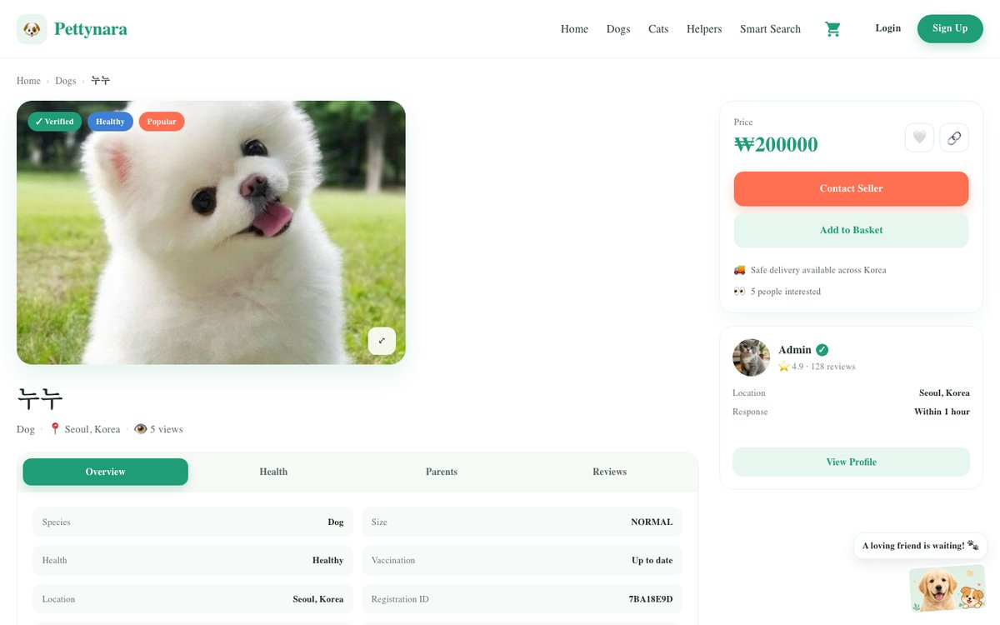

# Pettynara Web

React client for **Pettynara**, an online pet shop where customers browse pets and pet supplies, like products, and place orders.

**Live:** [pettynara.uz](https://pettynara.uz) · **Backend repo:** [pettynara](https://github.com/qazakhi515/pettynara)

[](https://github.com/qazakhi515/pettynara-react/actions/workflows/ci.yml)


> **한국어 요약**
> Pettynara 온라인 펫샵의 프론트엔드입니다. React · TypeScript · Redux Toolkit으로 상품 목록, 상세, 장바구니, 주문, 마이페이지를 구현했습니다. 이미지는 AWS S3에서 불러오며, Docker 멀티 스테이지 빌드와 Nginx로 배포했습니다.

## Screenshots


| Product list | Product detail |
|---|---|
|  |  |

## Features

- **Home:** hero, category row, popular and new products, accessories, top members, and a **Smart Match** quiz that suggests a pet from answers about home size, experience, free time, allergies and energy level.
- **Products:** paginated list with category filter, search and sorting; product detail with an image gallery, likes and related products.
- **Basket and checkout:** basket kept in `localStorage`, so it survives a page reload; order creation from the basket.
- **Orders:** paused, in-process and finished tabs. Payment is a demo card form; no real charge is made.
- **Account:** sign up and log in, profile settings with avatar upload, and a list of liked products.
- **Pet helpers and help center:** helper profiles, FAQ and terms (static content).
- **Responsive layout** for mobile and desktop.

## Tech stack

| Area | Tools |
|---|---|
| UI | React 18, TypeScript, MUI, styled-components, Swiper |
| State | Redux Toolkit with `reselect` selectors, React Context for the logged-in member |
| Routing | React Router 5 |
| API | Axios with cookies (`withCredentials`) |
| Testing | Jest (via Create React App), GitHub Actions |
| Build and deploy | Create React App, Docker multi-stage build, Nginx |

## Project structure

```
src/
├── app/
│   ├── App.tsx              # routes
│   ├── store.ts             # Redux store
│   ├── screens/             # pages; each has its own slice.ts and selector.ts
│   │   ├── homePage/
│   │   ├── productPage/
│   │   ├── ordersPage/
│   │   ├── checkoutPage/
│   │   ├── userPage/
│   │   ├── helpersPage/
│   │   └── helpPage/
│   ├── components/          # headers, footer, auth modal, basket hook
│   └── services/            # API calls: member, product, order, like
├── lib/
│   ├── config.ts            # API URL and getImageUrl()
│   ├── data/                # static content: helpers, FAQ, plans, terms
│   ├── types/, enums/, utils/
└── css/
```

## Implementation notes

- **One place for image URLs.** Images can be full S3 URLs (new uploads) or legacy `uploads/...` paths served by the API. `getImageUrl()` in [`src/lib/config.ts`](src/lib/config.ts) handles both, replacing 22 places that built URLs by hand. This let the frontend ship before the backend switched to S3 without breaking any images.
- **Page-level state.** Each screen owns a Redux slice and `reselect` selectors, which keeps a page's data separate from the others and avoids recomputing derived data.
- **Caching in Nginx.** Hashed files under `/static/` are cached for a year; `index.html` is always revalidated, so a new deploy is picked up on the next page load.

## Testing

```bash
yarn test --watchAll=false
```

24 unit tests cover `getImageUrl()`, the basket hook (pets stay at one, accessories stack, everything is saved to `localStorage`), shipping and totals, and phone validation. GitHub Actions runs the tests and a production build on every push and pull request. The API itself is tested in the [backend repo](https://github.com/qazakhi515/pettynara#testing).

## Getting started

Requirements: Node.js 20+, Yarn, and the [backend](https://github.com/qazakhi515/pettynara) running locally.

```bash
git clone https://github.com/qazakhi515/pettynara-react.git
cd pettynara-react
yarn install
yarn start              # http://localhost:3000
```

The API URL comes from `REACT_APP_API_URL`: `.env` points to `http://localhost:3003` for development, and `.env.production` points to `https://api.pettynara.uz` for builds.

| Script | Description |
|---|---|
| `yarn start` | Development server |
| `yarn build` | Production build in `build/` |
| `yarn test` | Tests in watch mode; `yarn test --watchAll=false` runs them once |

## Deployment

```bash
docker compose up -d --build
```

The first stage runs `yarn build`; the second copies the static files into an `nginx:alpine` image with the SPA config from [`deploy/nginx-spa.conf`](deploy/nginx-spa.conf). The container listens on `127.0.0.1:4004`, and the host Nginx serves it at `pettynara.uz` over HTTPS.

## Roadmap

- [ ] Move from Create React App to Vite, and to React Router 6
- [ ] Data fetching with TanStack Query
- [x] Unit tests for image URLs, basket, prices and phone validation, with CI
- [ ] Component and end-to-end tests (React Testing Library, Playwright)
- [ ] Fix the remaining ESLint warnings so CI can build with `CI=true`
- [ ] Korean and English UI (i18n)
- [ ] Kakao login and Toss Payments in place of the demo card form

## Author

**Akhmadjon Usmonov** · [GitHub](https://github.com/qazakhi515)
